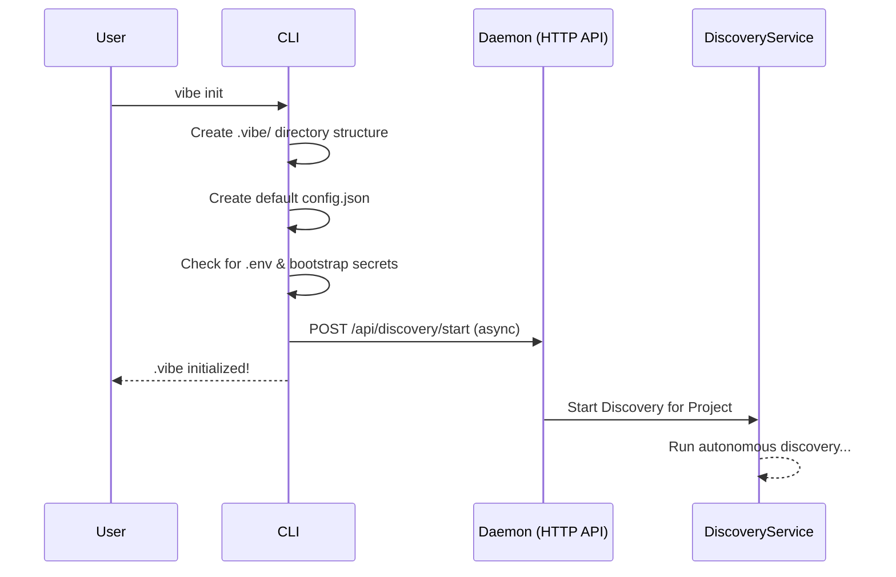
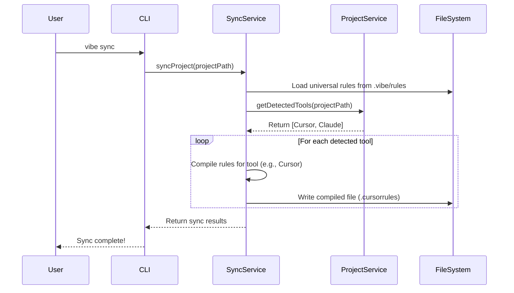
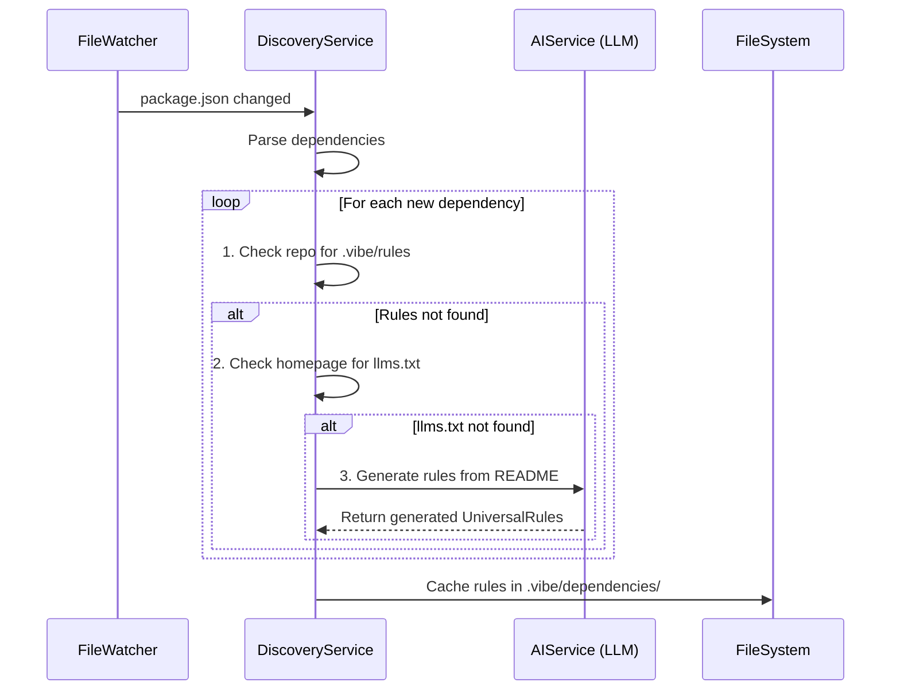
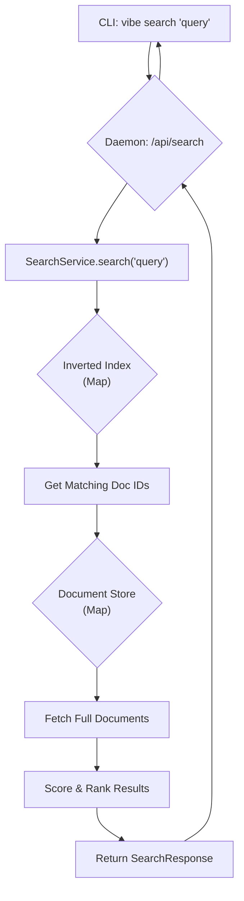

# Flows

## User Flows

### `vibe init`


> The `init` command is a fast, non-blocking operation that bootstraps the project and triggers a "fire-and-forget" discovery process on the background daemon.

### `vibe sync`


> The `sync` command compiles the single source of truth (.vibe/rules) into the specific formats required by each detected AI tool.

## System Flows

### Autonomous Dependency Discovery


> The daemon's discovery service follows a tiered approach, preferring explicit rules but falling back to AI-powered inference when necessary, ensuring all dependencies get context.

### Memory & Diary Operations

```mermaid
sequenceDiagram
    participant AITool (e.g., Cursor)
    participant MCP_Server (in Daemon)
    participant MemoryService
    participant SearchService
    participant FileSystem

    AITool->>MCP_Server (in Daemon): Add Memory Request
    MCP_Server (in Daemon)->>MemoryService: createMemory(data)
    MemoryService->>FileSystem: Save entry to .vibe/memory/
    MemoryService->>SearchService: indexDocument(memoryEntry)
    SearchService->>SearchService: Update in-memory index
    SearchService-->>MemoryService: Ack
    MemoryService-->>MCP_Server (in Daemon): Success
    MCP_Server (in Daemon)-->>AITool (e.g., Cursor): Ack

    participant CLI
    CLI->>MCP_Server (in Daemon): Search Memory Request
    MCP_Server (in Daemon)->>SearchService: searchDocuments("query")
    SearchService->>SearchService: Look up in inverted index
    SearchService-->>MCP_Server (in Daemon): Return search results
    MCP_Server (in Daemon)-->>CLI: Display results
```
> Core modules like MemoryService and DiaryService are simplified. They handle saving structured data and then delegate all indexing and retrieval tasks to the centralized SearchService.

## Architecture

### High-Level System Architecture

```mermaid
graph TD
    subgraph User Interaction
        User_CLI[User via CLI]
        User_Dashboard[User via Dashboard]
    end

    subgraph Vibe Daemon
        direction LR
        APIs[HTTP API / SSE]
        MCP[MCP Server]
    end

    subgraph External
        AITools[AI Tools e.g., Cursor]
        Internet[Internet <br/>(GitHub, NPM)]
    end

    FileSystem[.vibe Directory]

    User_CLI --> APIs
    User_Dashboard --> APIs
    AITools --> MCP
    
    APIs --> FileSystem
    MCP --> FileSystem
    APIs --> Internet
```
> The vibe-daemon is the central hub. Users interact via the CLI or Dashboard, while AI tools integrate via the MCP server. The daemon manages local file state and accesses the internet for discovery.

### Internal Service Architecture

```mermaid
graph TD
    subgraph Entry Points
        A[HTTP API]
        B[MCP Server]
    end

    subgraph Service Layer
        direction TB
        PS[ProjectService]
        DS[DiscoveryService]
        SS[SyncService]
        Search[SearchService]
        Mem[MemoryService]
        Diary[DiaryService]
        Secrets[SecretsService]
    end
    
    subgraph Core Lib
        Lib[lib/ <br/> (fs.ts, errors.ts)]
    end

    A --> PS; A --> DS; A --> Secrets; A --> Search
    B --> Mem; B --> Diary; B --> Search

    DS --> Internet[Internet APIs]
    
    Mem --> Search
    Diary --> Search
    
    PS --> Lib
    DS --> Lib
    SS --> Lib
    Search --> Lib
    Mem --> Lib
    Diary --> Lib
    Secrets --> Lib
```
> The architecture is composed of stateless services. Entry points (API/MCP) are thin wrappers that delegate to the service layer. Services like MemoryService and DiaryService are simplified by using the foundational SearchService.

### Search Query Flow


> A search query flows through the API to the SearchService, which uses a simple in-memory inverted index to efficiently find, score, and rank relevant documents, all without heavy external dependencies.
